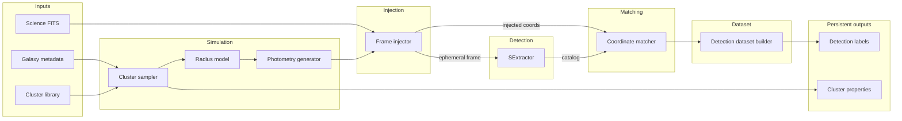

# Cluster Completeness Pipeline — Architecture & Refactor Design

**Staff-level design for a production-quality scientific ML pipeline.**  
Astrophysical simulations and completeness modeling for star clusters in galaxy images.

---

## 1. High-Level Data Flow



**Principle:** Synthetic FITS frames are **ephemeral**. Per (galaxy, frame, reff): inject → detect → match → write labels → delete frame.

---

## 2. Directory Structure

```
cluster_pipeline/
├── __init__.py
├── config/
│   ├── __init__.py
│   └── pipeline_config.py      # Single source of config (paths, sampling, matching, etc.)
├── data/
│   ├── __init__.py
│   ├── models.py                # Data models: SyntheticCluster, DetectionResult, etc.
│   ├── galaxy_metadata.py       # Load galaxy metadata (filters, zeropoints, paths)
│   └── cluster_library.py      # Load SLUG cluster library (thin wrapper)
├── simulation/
│   ├── __init__.py
│   ├── cluster_sampler.py      # Sample mass, age, av; assign radii
│   ├── radius_models.py        # Mass–radius models (flat, Krumholz19, Ryon17)
│   └── photometry_generator.py # Synthetic photometry from library
├── injection/
│   ├── __init__.py
│   └── frame_injector.py       # BAOlab wrapper: inject clusters into FITS
├── detection/
│   ├── __init__.py
│   └── sextractor_runner.py    # SExtractor wrapper: run on frame, return catalog path
├── matching/
│   ├── __init__.py
│   └── coordinate_matcher.py   # KD-tree match injected vs detected; output labels
├── dataset/
│   ├── __init__.py
│   └── detection_dataset_builder.py  # Aggregate labels + props into ML-ready arrays
├── pipeline/
│   ├── __init__.py
│   └── pipeline_runner.py       # Orchestrator: run_galaxy_pipeline(config)
└── utils/
    ├── __init__.py
    ├── filesystem.py           # Path helpers, safe temp dirs, no os.chdir
    └── logging_utils.py        # Structured logging
```

**Convention:** Each module stays under ~300 lines; single responsibility; no global state.

---

## 3. Data Models (Contracts)

All stages consume and produce **typed objects**; formats are explicit.

| Model | Location | Purpose |
|-------|----------|---------|
| `PipelineConfig` | config/pipeline_config.py | Paths, sampling params, matching tolerance, frame counts |
| `GalaxyMetadata` | data/galaxy_metadata.py | Filters, zeropoints, FITS paths, readme-derived params |
| `SyntheticCluster` | data/models.py | One cluster: mass, age, av, radius, position, photometry |
| `InjectionResult` | data/models.py | Paths to injected frame + coord file (or in-memory for ephemeral) |
| `DetectionResult` | data/models.py | Path to SExtractor catalog or parsed coords |
| `MatchResult` | data/models.py | Per-cluster: injected_id, matched (bool), detected_position (optional) |
| `DetectionLabelRecord` | data/models.py | One record for ML: (cluster_id, frame_id, reff_id, detected 0/1) |

---

## 4. Storage Strategy

| Artifact | Lifetime | Location |
|----------|----------|----------|
| Cluster library outputs | Persistent | `config.physprop_dir` (or equivalent) |
| Detection labels (per frame/reff) | Persistent | `config.labels_dir` or appended to dataset |
| Training dataset (detection + props) | Persistent | `config.output_dir` / explicit path |
| Synthetic FITS frame | **Temporary** | `utils.filesystem` temp dir; deleted after detection + match |
| SExtractor catalog / coo | **Temporary** | Same temp dir; deleted after match |
| Injected coord file | **Temporary** | Same temp dir; optional to keep for debugging |

**Pipeline rule:** After `coordinate_matcher.run(injected_coords, detected_catalog_path)` and writing the label row(s), the runner deletes the frame and any intermediates in that temp dir.

---

## 5. Pipeline Orchestration

**Entry point:** `run_galaxy_pipeline(galaxy_id: str, config: PipelineConfig) -> None`

**Steps (conceptual):**

1. **Load** galaxy metadata and cluster library (from config paths).
2. **For each** (frame_id, reff) in the configured grid:
   - Sample clusters (or load pre-sampled props).
   - Generate photometry; build injection list (positions + mags).
   - Create a **temporary directory** for this (galaxy, frame, reff).
   - Run **frame_injector**: write FITS + coord file in temp dir.
   - Run **sextractor_runner** on the FITS; get catalog/coo path.
   - Run **coordinate_matcher**: injected coords vs detected catalog → match result.
   - **dataset_builder.append**(match_result, cluster_props).
   - **Delete** temp dir (frame + catalog + coords).
3. **Finalize** dataset (e.g. write `.npy` / `.npz` for ML).

**Parallelism:** Runner can dispatch (frame_id, reff) to a process pool or job array; each worker gets its own temp dir and config (no `os.chdir`, no shared writable paths).

---

## 6. External Tool Isolation

- **BAOlab:** `injection.frame_injector` builds the script, runs `subprocess.run([baopath, "bl"], stdin=..., cwd=temp_dir)`, returns paths to generated frame + coords. No BAOlab logic outside this module.
- **SExtractor:** `detection.sextractor_runner.run(frame_path: Path, config: PipelineConfig) -> DetectionResult`. Runs `sex` with config-derived param file and output path; returns path to catalog/coo. No shell logic elsewhere.

---

## 7. Config-Driven Pipeline

All configurable values live in `PipelineConfig` (or a YAML/JSON loaded into it):

- **Paths:** `main_dir`, `fits_path`, `psf_path`, `bao_path`, `slug_lib_dir`, `output_lib_dir`, `temp_base_dir`, `labels_dir`.
- **Sampling:** `ncl`, `nframe`, `reff_list`, `mrmodel`, `dmod`, `M_LIMIT`.
- **Matching:** `thres_coord` (pixels), `validation` flag.
- **Detection:** SExtractor config path, param file path.
- **Logging:** Log level, log file path.

No hardcoded paths or magic numbers in pipeline or detection/matching code.

---

## 8. Robust Logging

- **Structured logging** (e.g. `logging.getLogger("cluster_pipeline")`) with levels INFO/DEBUG/ERROR.
- Log at stage boundaries: "Starting injection for galaxy=X frame=f reff=r", "Detection produced N sources", "Match: M/N injected matched", "Deleted temp dir X".
- Errors log exception and re-raise or return a result type so the runner can decide (retry, skip, fail).

---

## 9. Best Practices (Enforced)

- **PEP 8;** type hints on public functions; docstrings (Args, Returns, Raises).
- **pathlib.Path** for all paths; no `os.chdir`; runner passes absolute paths to each component.
- **No global state;** config and paths are passed in; components are pure or take config as argument.
- **Tests:** Each module is unit-testable with temporary config and mock paths.

---

## 10. Migration Path from Current Codebase

- **Phase 1:** Introduce `cluster_pipeline` package and config; keep existing scripts as legacy entry points that call into the new modules where possible (e.g. `load_slug_libraries` → `cluster_library`).
- **Phase 2:** Replace injection + detection + matching flow with `pipeline_runner` + ephemeral storage; keep BAOlab and SExtractor behind `frame_injector` and `sextractor_runner`.
- **Phase 3:** Move dataset building (Notebook logic) into `detection_dataset_builder`; ML training consumes outputs from the pipeline config.
- **Phase 4:** Deprecate monolithic scripts; single CLI entry point `run_pipeline --config ... [--galaxy] [--step]`.

---

## 11. Example Data Flow (One Frame, One Reff)

```
Inputs:
  - GalaxyMetadata(galaxy_id, filters, zeropoints, science_fits_paths)
  - ClusterLibrary(arrays: mass, age, av, phot...)
  - PipelineConfig

Step 1 — Sample:
  clusters = cluster_sampler.sample(ncl, reff, library, config)  -> List[SyntheticCluster]

Step 2 — Inject:
  injector = FrameInjector(config)
  frame_path, coord_path = injector.inject(frame_id, reff, clusters, galaxy_metadata)  # in temp_dir

Step 3 — Detect:
  det = sextractor_runner.run(frame_path, config)  -> DetectionResult(catalog_path=...)

Step 4 — Match:
  match_result = coordinate_matcher.match(coord_path, det.coord_path, config.thres_coord)  -> MatchResult

Step 5 — Append to dataset:
  dataset_builder.append(match_result, clusters, frame_id, reff)

Step 6 — Cleanup:
  filesystem.remove_tree(temp_dir)
```

## 12. Deliverables Summary

| Deliverable | Location |
|-------------|----------|
| Refactored pipeline architecture | This document (§1–§11) |
| Directory structure | `cluster_pipeline/` (§2) |
| Module responsibilities | §2, §3 |
| Coordinate matcher (example) | `cluster_pipeline/matching/coordinate_matcher.py` |
| SExtractor runner (example) | `cluster_pipeline/detection/sextractor_runner.py` |
| Pipeline orchestrator (example) | `cluster_pipeline/pipeline/pipeline_runner.py` |
| Data flow between stages | §1 (diagram), §11 (example) |
| Data models | `cluster_pipeline/data/models.py` |
| Config | `cluster_pipeline/config/pipeline_config.py` |
| Utils (filesystem, logging) | `cluster_pipeline/utils/` |

## 13. AST Pipeline Extension

Catalogue inclusion: (M, T, Av, magnitudes) → C ∈ {0,1}. New modules: `data/schemas.py`, `pipeline/manifest.py`, `photometry/`, `catalogue/`, `dataset/dataset_builder.py`, `pipeline/ast_pipeline.py` (`run_frame_pipeline`, `run_ast_pipeline`). cluster_id required; parquet intermediates; see README.
